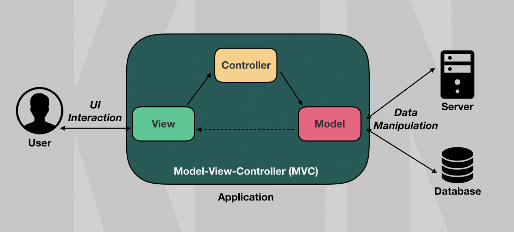
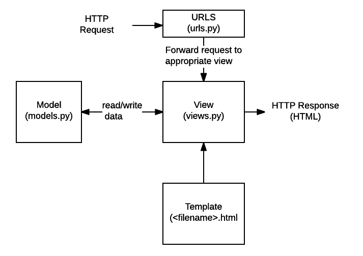
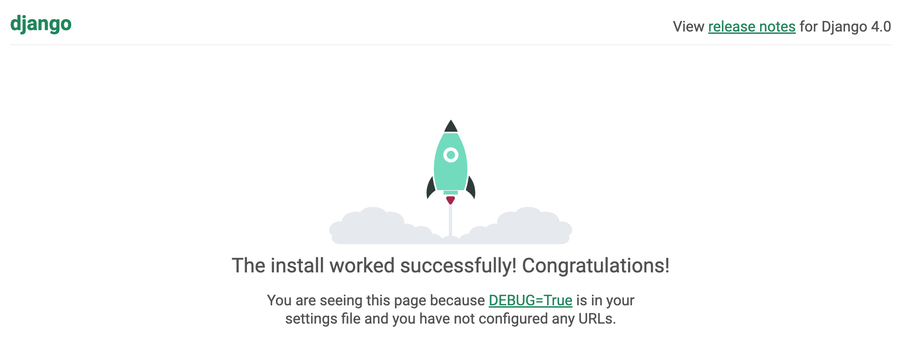
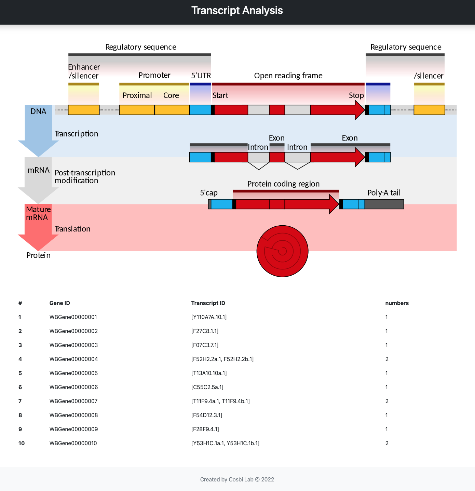

# Django I

## 基本介紹

[Django](https://docs.djangoproject.com/en/4.0/) 是一個近年相當熱門的網站框架，其模組化設計、開源社群廣大，且可以輕易整合各種 python 套件，讓它成為功能非常齊全的網站框架。除了基本的電子商務、社群網站，亦適合架設各種為了數據分析、機器學習的網頁工具。

在研究 Django 結構前，我們先來了解軟體工程常見的一種 MVC 架構。所謂 MVC，即模型 (Model)、視圖 (View)、控制器 (Controller)，分別介紹如下：

- **Model**：資料模組，即連結後端資料庫的部分，通常包含如何定義與存取資料的程式。例如，定義該網站會員的帳密、郵件、個人資訊等。
- **View**：視圖模組，也稱作表現層 (presentation layer)，即前端畫面的呈現，常見的是各種 html templates，像是網站的首頁、分頁、表單等。
- **Controller**：控制模組，即介於前後端之間，負責處理用戶請求 (request) 的中繼程式。包含各種互動功能 (action)、表單資料接收、數據分析等。

透過將應用程式模組化，可以將網站的複雜功能區分開來，專注在 Model、View、Controller 三個部分的開發。



Django 繼承了傳統 MVC 架構，使用了自己的 MTV 架構，分別是 Model、Template、View。分別介紹如下：

- **Model**：資料模組，主要設定是在 `models.py` 中。
- **Template**：視圖模組，一般常見在 templates 資料夾內放置各種 html 模板。
- **View**：控制模組（注意與 MVC 中的 View 不同），主要設定是在 `views.py` 與 `urls.py` 中。

當用戶發起 request（即瀏覽器輸入網址），Django 框架會在 `urls.py` 中尋找相應的動作，通常是工程師寫在 `views.py` 之中的某個功能函式、或是某個第三方服務（像是社群軟體登入）；有時候可能還會需要透過 `models.py` 去存取資料庫內容（像是會員註冊、留言）。當這一切流程跑完後，會將結果渲染到前端頁面去 (html templates)。




## Django 架構與功能

### 安裝 Django

我們可以直接透過 pip 來安裝 Django：

``` bash
(VENV)$ pip install django #安裝Django
(VENV)$ django-admin startproject <PROJECT NAME> #開始新專案，以下假設是Lab_Training
```
如果我們進入剛剛建好的專案 (Lab_Training)，會看到以下結構：
``` bash
(VENV)$ tree
.
├── manage.py
└── Lab_Training
    ├── __init__.py
    ├── settings.py
    ├── urls.py
    ├── asgi.py
    └── wsgi.py
```
代表你的第一個 Django 專案已經建立完成。

> **《 備註 》** 
> - Django 2.0 後有一些語法上的更動，實驗室工作站上大部分都還是 Django 1.x，未來要搬移到工作站上需要注意語法相容性（後續會陸續補充）。
> - 以下範例是使用 Django 4.0。


### 啟動伺服器


觀察專案內部可以發現，裡面有一個 `manage.py` 檔案，以及一個與專案同名的資料夾，內部也放了許多 python 檔案。我們先一個個介紹其功能：
- manage.py：此 Django 專案內的主要管理程式碼，當我們今天要新增 app 或是啟動 server 都要透過它。
- Lab_Training 資料夾：與專案名稱相同，負責放一些全域設定。
- \_\_init__.py：定義 python 模組。
- settings.py：整個專案的全域設定，包含套件管理、app 註冊、templates 連結、time zone 等等都會在這裡作設定。
- urls.py：網址設定檔，設定每個 URL 要對應到的函式。通常每新增一個網頁就需要編輯它。
- wsgi.py or asgi.py：讓網站上線所需要的介面設定檔，Apache Server 會去讀取此檔案。

如果我們在終端機輸入以下指令：
``` bash
$ python manage.py runserver #啟動Django伺服器
```
```
Watching for file changes with StatReloader
Performing system checks...

System check identified no issues (0 silenced).

You have 18 unapplied migration(s). Your project may not work properly until you apply the migrations for app(s): admin, auth, contenttypes, sessions.
Run 'python manage.py migrate' to apply them.

Django version 4.0.4, using settings 'Lab_Training.settings'
Starting development server at http://127.0.0.1:8000/
Quit the server with CONTROL-C.
```

終端機會提示你伺服器已經啟動，以及一些 migrations 尚未執行（暫時不用理它）。只要按照提示，開啟瀏覽器並輸入 http://127.0.0.1:8000/ 或是 http://localhost:8000/ ，就會看到你的第一個網頁畫面。



### 讓外部連線
一般創建完 Django project 就可以直接使用 localhost 在瀏覽器查看網站，但不能讓其他電腦連線進來，得另外作設定。請用任何程式編輯器打開 `Lab_Training/settings.py`，修改以下地方：
```python
# 對所有電腦內網卡 IP 開放連線
ALLOWED_HOSTS = ['*']
```

然後在啟動時加入參數：
```bash
# 0.0.0.0 代表監聽所有本機上的網卡連線
$ python manage.py runserver 0.0.0.0:8000
```

設定完畢後，輸入你目前網域的 Public IP (140.116.214.XXX) 與對應的 Port 就可以讓外部連線，例如：http://140.116.214.150:8000 。

### 建立網站

接著，我們來建立第一個 app。你可以簡單的將 app 理解成一個網站；換句話說，這個專案可以同時管理很多網站。
``` bash
$ python manage.py startapp web_tool
```

當我們建立第一個 app 叫 web_tool，會發現它在專案中創建一個同名資料夾，裡面有許多 python 檔；同時在專案內部多了一個資料庫 db.sqlite3。
```
├── web_tool
│   ├── __init__.py
│   ├── admin.py
│   ├── apps.py
│   ├── models.py
│   ├── views.py
│   ├── tests.py
|   └── migrations
│       └── __init__.py
├── db.sqlite3
├── manage.py
└── Lab_Training
...
```

然而，光是這樣還無法啟用這個 app，需要自行在專案內進行設定。請打開 `Lab_Training/settings.py`，修改以下兩個地方：
``` python
# Application definition

INSTALLED_APPS = (
    'django.contrib.admin',
    'django.contrib.auth',
    'django.contrib.contenttypes',
    'django.contrib.sessions',
    'django.contrib.messages',
    'django.contrib.staticfiles',
    'web_tool', # <--新增你的app
)

...

# Internationalization

LANGUAGE_CODE = 'zh-Hant' #語言
TIME_ZONE = 'Asia/Taipei' #時區
USE_I18N = True
USE_TZ = True
```
可以看到 Django 已經預先幫我們安裝了幾個常用 app，像是 admin（管理後台）、auth（登入功能）...。另外，我們還可以將系統語言設定為 zh-Hant（繁體中文），相關規範可以參考 i18n。


### 輸出頁面
接著，我們先來設定第一個網址。打開 `Lab_Training/urls.py`，並修改成以下樣式：
``` python
from django.contrib import admin
from django.urls import path
from web_tool import views #匯入你的 web_tool/view.py

urlpatterns = [
    path('admin/', admin.site.urls),
    path('hello/', views.hello_world), #新增網址與對應的動作
]
```
打開 `web_tool/views.py`，修改成以下樣式：
``` python
from django.shortcuts import render
from django.http import HttpResponse #匯入http模組

def hello_world(request):
    return HttpResponse("Hello World!")
```
這時重新啟動 server，輸入 http://127.0.0.1:8000/hello/ ，便可以看到你的第一個網頁訊息： ***Hello World!***

然而大家一定會想「我要的是美美的網站，可不是一句沒營養的話。」，所以我們接著來使用一些前端模板來美化我們的網站。

首先在專案下新增兩個資料夾 templates、static，static 下再新增 js、css、images 資料夾。此時，專案結構應該如下：
```
├── web_tool
│   └── ...
├── db.sqlite3
├── manage.py
├── Lab_Training
│   └── ...
├── static
│   ├── css
│   ├── images
│   └── js
└── templates
```
如此便可以將前、後端劃分開來，方便前端工程師專注在自己的網頁模板設計。其中，templates 資料夾專門放 html 模板。

我們接著打開 `Lab_Training/settings.py`，修改關於 templates 與 [static](https://docs.djangoproject.com/en/3.2/howto/static-files/) 的部分：
``` python
TEMPLATES = [
    {
        'BACKEND': 'django.template.backends.django.DjangoTemplates',
        'DIRS': [BASE_DIR / 'templates'], # <--修改這裡！
        'APP_DIRS': True,
        'OPTIONS': {
            'context_processors': [
                'django.template.context_processors.debug',
                'django.template.context_processors.request',
                'django.contrib.auth.context_processors.auth',
                'django.contrib.messages.context_processors.messages',
            ],
        },
    },
]

...

# Static files (CSS, JavaScript, Images)

STATIC_URL = 'static/'
STATICFILES_DIRS = [BASE_DIR / "static"] # <--修改這裡！
```

- **補充：** Django 2.0 以前是使用 os 模組來讀取路徑，設定如下
``` python
import os
...
os.path.join(BASE_DIR, 'DIR NAME') #將templates、static位置改成這樣
```

接著我們來新增第一個檔案 `templates/hello_world.html`：
``` html
<!DOCTYPE html>
<html>
    <head>
        <title>hello world！</title>
    </head>
    <body>
        <h1 style="color:red;">這是我的第一個Django網站</h1>
        <hr>
        <h3>現在時刻：{{ time }}</h3>
    </body>
</html>
```

然後修改 `web_tool/views.py`：
``` python
from django.shortcuts import render
from django.http import HttpResponse
from datetime import datetime

def hello_world(request):
    time = datetime.now()
    return render(request, 'hello_world.html', locals())
```
這裡，我們利用 render() 函數來渲染模板，利用 locals() 函數來打包所有變數。改完後結果如下：


美化過的頁面出來了，可以開始進一步做網頁設計與規劃。

## 網頁模版

### 需求分析

我們來重新檢視之前提過的網頁工具範例：**[pirScan](http://cosbi4.ee.ncku.edu.tw/pirScan/)**


- **Scan**
    - **Header：** Navigation Bar
    - **Content：** Input、Targeting Rules、Reference...
    - **Footer：** Copyright
- **Tutorial**
    - **Header：** Navigation Bar
    - **Content：** About、Usage、Motivation...
    - **Footer：** Copyright
- **Contact**
    - **Header：** Navigation Bar
    - **Content：** Dr. Wei-Sheng Wu.、Co-authors...
    - **Footer：** Copyright 

從剛剛的規劃來看，我們至少需要三個 html 檔，分別是 Scan、Tutorial、Contact。然而實際上，我們往往會將一個完整網頁切成好幾個 html section 來設計。這是由於網頁大部分的排版常是由幾個固定的版面部件所構成，例如相同的頁首 (header) 、頁尾 (footer) 與側邊欄 (side bar)。

同樣的主視覺元素和顏色，可以確保網站瀏覽體驗是一致的；而切開各部件 html，可以確保程式碼精簡並進行模組化設計，才不會每次需要稍微調整內容（例如調整頁首中的導覽列 Navigation bar），就需要到處修改。

### 前端實作

在此前提下，我們先來設計第一個模板 base.html：
``` html
<!-- base.html -->
<!DOCTYPE html>
<html>
    <head>
        <meta charset="utf-8">
        <meta name="viewport" content="width=device-width, initial-scale=1">
               
        <!-- Bootstrap CSS & JS -->
        <link href="https://cdn.jsdelivr.net/npm/bootstrap@5.0.2/dist/css/bootstrap.min.css" rel="stylesheet" integrity="sha384-EVSTQN3/azprG1Anm3QDgpJLIm9Nao0Yz1ztcQTwFspd3yD65VohhpuuCOmLASjC" crossorigin="anonymous">
        <script src="https://cdn.jsdelivr.net/npm/bootstrap@5.0.2/dist/js/bootstrap.bundle.min.js" integrity="sha384-MrcW6ZMFYlzcLA8Nl+NtUVF0sA7MsXsP1UyJoMp4YLEuNSfAP+JcXn/tWtIaxVXM" crossorigin="anonymous"></script>
        
        <!-- jQuery -->
        <script src="https://ajax.googleapis.com/ajax/libs/jquery/3.5.1/jquery.min.js"></script>
        
        <title>
             
        </title>
    </head>
    <body>
        <!-- header -->
        <header class="py-3 mb-5 text-center bg-dark shadow">
            <h2 class="text-light">Transcript Analysis</div>
        </header>
        
        <!-- content -->
         

        <!-- footer -->
        <footer class="py-4 mt-5 text-center text-muted bg-light border-top">
            Created by Cosbi Lab &copy; 2022
        </footer>
    </body>
</html>
```
這邊我們引入 Bootstrap 5 前端框架來美化網頁，並透過 Django 的語法 `` 來切割 html 。

`` 是 Django 在 templates 中處理邏輯判斷式的語法，官方叫做 tags，可以參考 [相關文件](https://docs.djangoproject.com/en/4.0/ref/templates/builtins/#ref-templates-builtins-tags)。

> Tags provide arbitrary logic in the rendering process.

它可以用在許多地方，像是 if-else 判斷式或 for 迴圈。在這邊我們我們使用 `` 與 `` ，來讓其他 html 繼承並客製化相關區塊，像是 title、sidebar、content。

我們也可以使用 `` 來引入其他 html 檔，例如  `header.html`、`footer.html`，方便我們模組化設計各個部件。

接著我們來看主頁所對應到的 index.html：
``` html
<!-- index.html -->


 home 

<div class="container">
    
    <table class="table table-hover">
        <thead>
            <tr>
                <th scope="col">#</th>
                <th scope="col">Gene ID </th>
                <th scope="col">Transcript ID</th>
                <th scope="col">numbers</th>
            </tr>
        </thead>
        <tbody>
            
            <tr>
                <th scope="row">{{ forloop.counter }}</th>
                <td>{{ gene.id }}</td>
                <td>{{ gene.transcript | cut:"'" }}</td>
                <td>{{ gene.number }}</td>
            </tr>
            
        </tbody>
    </table>
</div>

```
在這裡，我們首先透過 `` 繼承 base.html 的所有內容，接著將 `` 的內容補上。在 content 中我們使用了一個 for-loop ，將 genes 的所有內容逐步讀出，變數 (variables) 的傳遞方式則是透過 Django 的語法 `{{ ... }}`，官方說明如下：

>A variable outputs a value from the context, which is a dict-like object mapping keys to values.

此外，Django 還提供 filter 語法，方便我們將變數內容進一步轉換。在此例中，我們利用 `{{ gene.transcript | cut:"'" }}` 去除字串中多餘的「 ' 」。關於 filter 的使用可以參考 [官方文件](https://docs.djangoproject.com/en/4.0/ref/templates/builtins/#built-in-filter-reference)。

另外，如果我們需要讀入媒體檔案，可以透過 Django 語法 `` 來讀入特定路徑，並在前面加上 `` 語法（整份 html 只需要打一次）。

> 補充：Django 2.0 以前是使用  語法

### 後端實作

接著，我們在 project 中新增 `data/hw1_output_ans.csv`，並增加主頁相關函式至`views.py`：
``` python
import pandas as pd
import json

def index(request):

    df = pd.read_csv('data/hw1_output_ans.csv')
    df = df.head(10)
    df = df.rename(columns={"Gene_ID": "id",
                            "transcript_ID": "transcript",
                            "# of transcripts": "number",
                            })
    json_string = df.to_json(orient='records')
    genes = json.loads(json_string)

    return render(request, 'index.html', locals())
```
這裡仿照之前的作法，傳遞 genes 變數。我們將 genes 輸出成 JSON（JavaScript Object Notation） 格式，類似於 python 中 list 與 dict 的組合，方便我們進一步獲取其 Gene ID、Transcript ID、numbers 等屬性。如果輸出 DataFrame 與 JSON String，會如下面所展示。
- **DataFrame**
```
               id                      transcript  number
0  WBGene00000001                ['Y110A7A.10.1']       1
1  WBGene00000002                   ['F27C8.1.1']       1
2  WBGene00000003                   ['F07C3.7.1']       1
3  WBGene00000004    ['F52H2.2a.1', 'F52H2.2b.1']       2
4  WBGene00000005                ['T13A10.10a.1']       1
5  WBGene00000006                  ['C55C2.5a.1']       1
6  WBGene00000007    ['T11F9.4a.1', 'T11F9.4b.1']       2
7  WBGene00000008                  ['F54D12.3.1']       1
8  WBGene00000009                   ['F28F9.4.1']       1
9  WBGene00000010  ['Y53H1C.1a.1', 'Y53H1C.1b.1']       2
```
- **JSON String**
```
[{"id":"WBGene00000001","transcript":"['Y110A7A.10.1']","number":1},
{"id":"WBGene00000002","transcript":"['F27C8.1.1']","number":1},
{"id":"WBGene00000003","transcript":"['F07C3.7.1']","number":1},
{"id":"WBGene00000004","transcript":"['F52H2.2a.1', 'F52H2.2b.1']","number":2},
{"id":"WBGene00000005","transcript":"['T13A10.10a.1']","number":1},
{"id":"WBGene00000006","transcript":"['C55C2.5a.1']","number":1},
{"id":"WBGene00000007","transcript":"['T11F9.4a.1', 'T11F9.4b.1']","number":2},
{"id":"WBGene00000008","transcript":"['F54D12.3.1']","number":1},
{"id":"WBGene00000009","transcript":"['F28F9.4.1']","number":1},
{"id":"WBGene00000010","transcript":"['Y53H1C.1a.1', 'Y53H1C.1b.1']","number":2}]
```


最後，我們加上對應的網址到 `urls.py`：
``` python
urlpatterns = [
    path('admin/', admin.site.urls),
    path('', views.index),
]
```

全部完成後，進入 http://localhost:8000/ ，成果如下：



這樣我們的首頁模板就完成了，以下再附上一些常用的 Django Templates 語法：

### Tags

| 名稱 | 用法 | 範例 |
| ---- | ---- | --- |
| include | 引入文件 |  |
| extends | 繼承文件 |  |
| block | 切割區塊 |   |
| if-else | 條件式 |     |
| for-loop | 迴圈式 |    |
| static | 讀入媒體 |   |

- 以下是 for 迴圈內常用的方法與變數

| 名稱 | 用法 | 範例 |
| ---- | ---- | ---- |
| cycle | 重複特定值 |  重複黑白 |
| counter | 迴圈計數器 | forloop.counter0, forloop.counter 從0、1開始計算 |
| revcounter | 迴圈倒數器 | forloop.revcounter0, forloop.revcounter |
| first, last | 迴圈首末值 | forloop.first, forloop.last |
| parentloop | 取上層迴圈 | forloop.parentloop |


### Filter

| 名稱 | 用法 | 範例 |
| ---- | ---- | ---- |
| addslashes | 加上跳脫字元 | \{\{It's a cat \| addslashes}} 變成 It\\'s a cat |
| cut | 移除特定字串 | \{\{value \| cut:" "}} 移除空白 |
| date | 設定日期顯示格式 | \{\{value \| date:"Y-m-d-H-i-s}} 年-月-日-時-分-秒|
| default | 預設值 | \{\{value \| default:"某個預設值"} | \{\{value \| dicsort:"date"}} 用時間排序 |
| escape | 將 HTML tags 表示成字串 | \{\{value \| escape}}
| first, last | 只取出首或末值 | \{\{value \| first}} |
| length | 回傳長度 | \{\{value \| length}} |
| truncatechars | 裁切指定長度，剩下用"..." | \{\{value \| truncatechars:"25"}} 取前25個字 |

- **補充(一)：** 渲染 Render

以上所有步驟都稱為 **Server-side Rendering (SSR)**。HTML 內的所有元素都是在 Django views 中預先繪製完成，除了 Bootstrap 部分功能外，不需要前端使用者額外負擔運算資源。優點是效能好、SEO 佳，缺點是彈性低。

與其相對就是 **Client-side Rendering (CSR)**。我們其實可以將後端資料全部打包成 JSON 格式送到前端，再由前端 JavaScript 進行表格繪製。這種作法可以降低 Server 端的運算負擔，而且彈性高，但是 SEO 較差，往往需要使用動態爬蟲獲取網頁資料。

- **補充(二)：** 搜尋引擎優化 Search Engine Optimization (SEO)

Google 這類搜尋引擎會針對網頁載入速度、文章內容、HTML tag 等多項標準進行歸類與評分，進而影響其在搜尋引擎上的前後排名。如果使用 CSR，許多內容可能無法簡單被爬蟲抓到，進而降低 SEO 分數。


## 網址管理

有時候，我們會希望同一個專案可以有一個獨立的 URL，底下的每個 APP 再獨立出 URLs，這就是結構化的網址管理。

在 Django，網址統一放在 `Lab_Training/urls.py` 中管理。我們可以將每個 APP 資料夾中再創建 `urls.py`，製造結構化網址。

首先修改 `Lab_Training/urls.py`：
```python
from django.contrib import admin
from django.urls import path, include

urlpatterns = [
    path('admin/', admin.site.urls),
    path('web_tool/', include('web_tool.urls')),
]
```

接著新增 `web_tool/urls.py`：
```python
from django.urls import path
from . import views

urlpatterns = [
    path('', views.index),
]
```

新的網址就會出現在 http://127.0.0.1:8000/web_tool/ 之後。

#### 補充
Django 2.0 以前對於網址的語法，是使用正規表示式 (Regular Expression)，如下所示：
```python
urlpatterns = [
    url(r'^admin/', admin.site.urls),
    url(r'^$', views.index),
]
```
