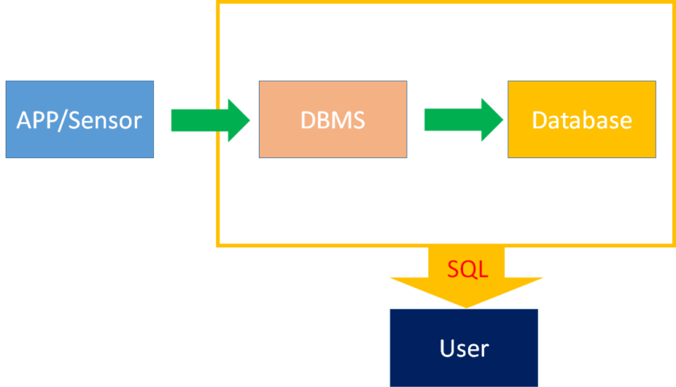
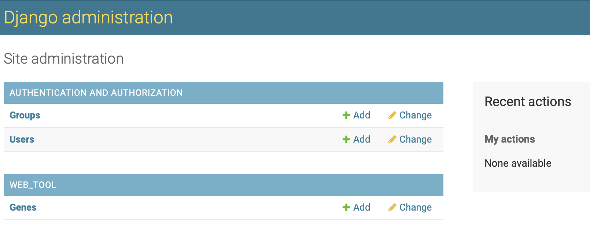
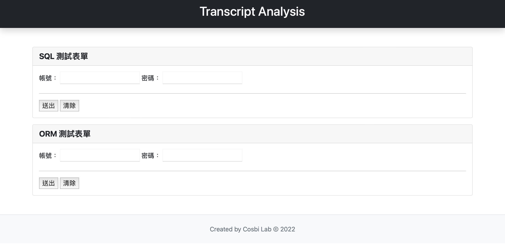

# Django II

> - Webex 會議錄製檔： 20220801 0612-1 新生訓練 Django MySQL  
>   密碼： Zt5UKkhp  
>   錄製檔鏈結： https://nckucc.webex.com/nckucc/ldr.php?RCID=84440834dd1523b63aa43b45494dd570

## 資料庫

### 簡介
想像一下，如果今天要在資料夾內找一個檔案，我們可能會選擇直接點開資料夾，然後一個個慢慢找。如果今天檔案很多 (也許幾十筆)，我們可能會需要更多資料夾來分類、整理我們的檔案。如果今天檔案真的非常非常多 (也許幾十萬筆)，我們可能會想透過某種更有效率的方式 (例如搜尋名字、種類、tags ) 來取得我們要的資料。這時候，資料庫將會大大改善我們的搜尋效率。

資料庫 (Database, DB) 是一種系統化儲存資料的方法，他需要配合資料管理系統 (Database Management System, DBSM) 來存取資料，並利用結構化查詢語言 (Structured Query Language, SQL) 來快速搜尋我們要的資料。



雖然我們可以用 python 直接讀取 csv 檔，可是一旦檔案過多、過大，每次反覆讀取整份文件就會浪費許多時間。這時適當使用資料庫可以有效幫我們節省資料讀取與搜尋的時間。

### 使用 SQLite

打開 `mysite/settings.py`，找到 database 的區塊：
```python
DATABASES = {
    'default': {
        'ENGINE': 'django.db.backends.sqlite3',
        'NAME': BASE_DIR / 'db.sqlite3',
    }
}
```
這裡可以設定資料庫的引擎 (ENGINE)，Django 預設是使用 SQLite3，你也可以改成 MySQL、PostgreSQL 等其他常用的關聯式資料庫。

為了教學與開發上的方便，後續皆是使用 SQLite 作示範。

### 使用 MySQL
如果我們要開發大型專案，並且多人共用同一個資料庫，通常會使用 MySQL 等獨立資料庫伺服器來取代預設的 SQLite。目前實驗室的工作站皆是使用 MySQL，但對於一般小型專案與練習並非必要。

首先在資料庫伺服器下載 MySQL Server 與跟 Python 溝通的工具：
``` bash
$ apt install mysql-server
$ apt install python3-dev libmysqlclient-dev
$ mysql_secure_installation
```
接著在你的專案伺服器安裝 MySQL 客戶端：
```bash
$ pip install mysqlclient
```

然後修改 settings.py 中關於 database 的設定如下:
``` python
DATABASES = {
    'default': {
        'ENGINE': 'django.db.backends.mysql',
        'NAME': '資料庫名稱',
        'USER': '連接的帳號',
        'PASSWORD': '密碼',
        'HOST': 'IP位置',
        'PORT': 'Port值',
        'OPTIONs': {
            'init_command': "SET sql_mode='STRICT_TRANS_TABLES'",
        },
    }
}
```

這樣就可以順利轉移連線的資料庫。如果要將現有資料搬移過去，則必須使用 SQL 指令來匯出與匯入資料表，或是透過第三方應用程式，例如 phpMyAdmin，來進一步對資料表進行操作。

除了自己架設 MySQL 伺服器外，也可以使用其他商用雲端 SQL 伺服器，例如 Google Cloud Platform SQL、Amazon RDS 等等，降低自行維護伺服器的負擔。

### SQL 語法

如果我們要存取關聯式資料庫的內容，必須使用結構化搜尋語言 (SQL) 來與資料庫本體互動。

SQL 語法使用分號 `;` 當作結尾，英文字母不區分大小寫，單字間使用空白分隔。單行註解使用 `--`，多行註解使用 `/**/`。

- DDL（Data Definition Language）
    - 新增 CREATE
    - 修改 ALTER
    - 刪除 DROP
- DML (Data Manipulation Language）
    - 插入 INSERT
    - 讀取 SELECT
    - 更新 UPDATE
    - 刪除 DELETE
- DCL (Data Control Language）
    - 設定操作權限，暫時用不到

#### 範例：搜尋特定資料
```sql
SELECT gene_id FROM Gene WHERE numbers > 2;
```

## Model

### 簡介

一般資料庫是使用 SQL 指令來存取資料，但在 Django 中是使用 Object Relational Mapping (ORM) 方式來存取資料。透過建立抽象化的 model ，將資料視為一種「物件」，就可以用 python 的方式來處理資料，而不用擔心底層的資料設定。

使用 model 時，我們必須先進入 `models.py` 中設計每個資料表的 class，再利用以下指令把虛擬層的 class 寫入真的資料庫 ( SQLite ) 中：
``` bash
$ python manage.py makemigrations #產生 class 描述檔案，位置在 app/migrations 中
$ python manage.py migrate #根據描述檔來變更資料庫設定
```

如果要讓 Django 預設的 admin 介面能夠讀取資料庫 ( 實際上是讀取虛擬層的 model )，就必須另外在 `admin.py` 中啟用剛剛設計好的 model（後續會詳述）。

如果要讓 `views.py` 順利讀取資料庫，除了透過 SQL 語法，也可以直接透過 ORM 的方式來進行操作，例如：
``` python
table1 = models.Table.objects.all() #取得此 Table 的全部資料
table2 = models.Table.objects.get(id='001') #取得此 Table 的某筆資料
table3 = models.Table.objects.filter(num<10) #篩選此 Table 的某些資料
```

### 使用 Model

接著我們打開 `web_tool/models.py`，新增第一個資料模型 Gene：
``` python
from django.db import models

class Gene(models.Model):
    gene_id = models.CharField(max_length=100)
    transcript_id = models.CharField(max_length=100)
    numbers = models.IntegerField()

    def __str__(self):
        return self.gene_id
```
Gene 中要存什麼內容是我們自己設計的。其中，\_\_str__ 是 python 常用的方式，讓回傳資料有一個顯示的依據（此處是 gene_id ）。

建立好 model 後，我們還需要讓它同步到資料庫內。請在終端機執行以下兩行指令：
``` bash
$ python manage.py makemigrations #建立web_tool/migrations/0001_initial.py
$ python manage.py migrate #根據檔案同步資料庫
```
這樣就可以使用資料庫了。但是為了管理方便，Django 還提供一個後台介面供我們直接操作資料。請先輸入以下指令，並按照指示建立管理員帳號：

``` bash
$ python manage.py createsuperuser
```

按照步驟設定完帳密後，確認 urls.py 中應該有預設好路徑：
```python
urlpatterns = [
    path('admin/', admin.site.urls), #<-這個！
    ...
]
```

請注意，每在 `models.py` 中新增一個 class，就必須去你 APP 下的 `admin.py` 中讀入這個 class，才可以順利在管理介面看到你的資料，相關設定可以參考 [教學文件](https://developer.mozilla.org/zh-TW/docs/Learn/Server-side/Django/Admin_site)。
```python
# admin.py
from <your_app> import models

class <your_admin_class>(admin.ModelAdmin): #客製化你的 admin 介面
    list_display = ('',...) #要顯示的欄位
    search_fields = ('',...) #能夠被搜尋的欄位
    list_filter = ('',...) #很難用的 filter，只適合種類不多時
    ordering = ('',...) #讓資料表用某個欄位預先排序
    
admin.site.register(models.<your_class>,<your_admin_class>) #這行一定要寫才能抓你的 model class，如果資料表很多的話可以改用 decorator 的方式
```

我們打開 `web_tool/admin.py`，將剛剛建立好的 model 放入後台來管理：
``` python
from django.contrib import admin
from web_tool.models import Gene

class GeneAdmin(admin.ModelAdmin): #設定Gene介面的外觀
    list_display = ('gene_id','transcript_id','numbers')

admin.site.register(Gene, GeneAdmin) #註冊Gene model
```
啟動server後，進入 http://127.0.0.1:8000/admin ，便可以看到後台登入介面。輸入剛剛註冊過的管裡員帳號，就可以看到精美的資料庫頁面。



為了練習方便，我們先在這裡建立幾筆資料。


完成後，我們要讓前端能夠順利看到剛剛新增的內容，必須重新設定 views 與 templates。

打開 `web_tool/views.py`，改寫如下：
```python
from django.shortcuts import render
from django.http import HttpResponse
from web_tool.models import Gene

def index(request):
    genes = Gene.objects.all()
    return render(request, 'index.html', locals())
```

接著進入 http://127.0.0.1:8000/web_tool/ ，就可以看到剛剛的資料顯示在前端。


透過以上操作，大家應該可以初步理解 Django 的運作流程。Django 透過 Model、Template、View 形成模組化的 MTV 架構，分別處理不同的功能，讓網站開發變得相當有條理。

### 常用資料格式

Model 常用的資料格式 (Field) 與參數可以參考 [官方文件](https://docs.djangoproject.com/en/3.2/ref/models/fields/)。

| 格式 | 參數 | 說明 |
| ---- | ---- | ---- |
| BooleanField |  | 布林值，只有True、False |
| CharField | max_length | 單行資料的字串 |
| DateField, DateTimeField | auto_now：每次儲存時自動更新時間 auto_now_add：第一次儲存時更新時間 | 日期格式 |
| DecimalField | max_digits：最大位數 decimal_places：小數位數 | 定點小數 |
| EmailField | max_length | 電子郵件格式 |
| FloatField | | 浮點數格式 |
| IntegerField | | 整數格式 |
| TextField | | 長文資料，用於 html textarea |
| URLField | max_length | 類似 CharField |
| FileField | max_length, upload_to：路徑 ||
| ImageField | upload_to, height_field, width_field, max_length | |

### 常用參數

| 參數 | 說明 |
| ---- | ---- |
| null | 是否接受空值，預設是 False |
| blank | 是否接受空白內容，預設是 False |
| choices | 欄位候選值，包含儲存內容與選項名稱 |
| default | 預設值 |
| primary_key | 設定為資料表為主鍵，預設是 False |
| verbose_name | admin 介面的欄位名稱 |

### 資料關係格式

Model 有提供定義資料間關係的語法，可以將此模型指向另一個模型的主鍵 (primary key) 。如果沒有特別定義主鍵， Django 會在產生模型時自行增加一個 id 作為主鍵。

| 格式 | 說明 |
| ---- | ---- |
| ForeignKey (to, on_delete) | many-to-one relationship |
| ManyToManyField (to) |  |
|  OneToOneField (to, on_delete, parent_link=False) ||

當我們想刪除上層 (parent) 資料時，必須定義如何處理下層 (child) 的資料，這時可以用 on_delete 參數，例如 `on_delete=models.CASCADE` 代表一併刪除下層元素。其他常用語法如下：
- models.PROTECT：禁止刪除，產生 exception
- models.SET_NULL：設定成 null ，但要先讓 null=True
- models.SET_DEFAULT：設定成 default ，但要先設定預設值
- models.DO_NOTHING：不處理

### 資料存取方式

當我們要存取資料時，只要使用 ORM 語法即可，如以下範例：
``` python
genes = Gene.objects.all() #取得此物件全部元素
```
其他常用常用函式如下：

| 名稱            | 說明                                         |
| --------------- | -------------------------------------------- |
| all()           | 回傳全部值                                   |
| get()           | 回傳 <mark>唯一值</mark>，建議配合try/except |
| filter()        | 回傳符合條件的值，若無自動回傳空值           |
| exclude()       | 回傳不符合條件的值                           |
| first(), last() | 回傳第一、最後的值                           |
| exists()        | 判斷是否存在 |
| create() | 建立一欄資料 |
| save() | 儲存資料進資料庫 |
| delete()        | 刪除資料                                       |
| oreder_by()     | 將回傳資料排序，加負號則逆序                 |

### 補充

另外，網站實際上線到工作站的 Apache 上時，會無法順利讀取 admin 介面的 css，這是因為 Apache 需要透過 wsgi 讀取你的 Django project，但是 `settings.py` 中預設只去讀取 static 中的檔案。解決辦法，可以將虛擬環境中的 Django 套件中的 static 路徑找出來，丟進去你 project 的 static。

路徑一般會在 `django/contrib/admin/static` 中，如果不知道你的 Django 套件路徑在哪，請輸入以下指令:
```bash
$ python -c "import django; print(django.__path__)"
```

## 存取資料表
使用 Django 預設的 admin 介面，可以遠端查看、新增、刪除資料，但是無法直接匯入資料表。對於大數據分析來說，要一筆一筆新增資料幾乎是不可能的任務。

我們可以使用第三方應用程式 [DB Browser](https://sqlitebrowser.org/) ，透過圖形化介面來存取 SQLite 資料庫。如果是使用 MySQL，則可以使用 [phpMyAdmin](https://www.phpmyadmin.net)。

它們與 Django admin 的差別在「整理資料的能力」與「能否遠端顯示」，建議大家可以混合著運用。

### DB Browser
首先選擇 Open Database，找到並打開你的 Django SQLite 資料庫；接著選擇 File > import > Table from CSV file，找到並打開你的 CSV 資料表。


因為 CSV 本身沒有 data type 的描述，只有用 comma 來區分資料，所以如果直接用 DB Browser 來讀取，會自動偵測格式。如果格式偵測失敗，就需要另外修改資料格式。

直接在 Database Structure 按下資料表，選擇 Modify Table，就可以修改特定 field 的名稱與格式。請注意，如果要將資料表給 Django 使用，必須設定 **primary key** 。只要選擇任一個 unique 欄位（ 或自己創建 index ），將 PK 欄位打勾就行。


匯入資料表後，如果要在 Django 使用 ORM 語法，我們還必須將欄位寫入 `models.py` 中。可以直接利用以下指令來自動完成 model：
```bash
$ python manage.py inspectdb > web_tool/models.py
```

大家可以進入 `models.py`，比較看看自己寫的跟自動產生的模組有什麼不同？
```python
class Gene(models.Model):
    gene_id = models.TextField(blank=True, primary_key=True) # <--注意！
    transcript_id = models.TextField(blank=True, null=True)
    numbers = models.IntegerField(blank=True, null=True)

    class Meta:
        managed = False
        db_table = 'Gene'
```

**注意：** 有人反應 inspectdb 會讀取資料格式失敗，特別是發生在 primary key 上。請在執行 inspectdb 後自己檢查一下所有 `models.py` 的設定都正確。

### 補充

1. 如果不自行設定 primary key，Django 會在某些 ORM 操作中失敗。可以透過 makemigrations、migrate 來產生資料庫設定檔，Django 會自己創一個欄位 id 作為 primary key。

2. 如果出現以下 Error ，這是因為舊 model 在更新時不知道該怎麼處理新的資料格式。可以根據提示給一個預設值，或是在資料中加入參數 `default=None` ，解決預設值的問題。

```
You are trying to add a non-nullable field to post without a default; we can't do that (the database needs something to populate existing rows).
Please select a fix:
 1) Provide a one-off default now (will be set on all existing rows with a null value for this column)
 2) Quit, and let me add a default in models.py
```

## 資料安全
最後，我們來談談為什麼要使用 Django Model ORM 語法，而不是直接使用 SQL 語法來操作關聯式資料庫。

之前曾經在模組化設計中提到過，我們為了資訊隱藏與獨立性，有時會將部分功能完全拆開。資料庫的設計、讀取方式本身可以是一門學問，有些公司甚至會有專業的資料庫工程師來做資料庫最佳化，並設計資料庫 API 給網頁後端工程師使用。

使用 API 除了可以更專注在後台開發上，也可能防止駭客透過 SQL 語法的漏洞來入侵資料庫。

### SQL injection

SQL injection 是一種透過 SQL 語法來測試網站漏洞，進一步取得敏感資訊、竄改個資等目的，嚴重的話甚至能作為進階攻擊手段的跳板。


為了測試 SQL injection，我們先試著建立一份含使用者個資的資料表在資料庫中：

```python
# models.py
class User(models.Model):
    user_id = models.CharField(max_length=100)
    user_pass = models.CharField(max_length=100)
    user_content = models.TextField()
  
    
# admin.py
from .models import User
class UserAdmin(admin.ModelAdmin):
    list_display = ('user_id','user_pass','user_content')
admin.site.register(User, UserAdmin)
```

接著我們試著建立幾組用戶資訊：


然後設計一個供使用者登入帳密的表單頁面 `form.html`：
```html


 Form Test 

<div class="container">
    <div class="card">
        <div class="card-header fs-5 fw-bold">
            SQL 測試表單
        </div>
         
        <div class="alert alert-warning">{{ message }}</div>
        
        <div class='card-body'>
            <form name="comment" method="GET">
                <label for="user_id">帳號：</label>
                <input type="text" id="user_id" name="user_id">
                <label for="user_pass">密碼：</label>
                <input type="password" id="user_pass" name="user_pass" class="mb-2">
                <hr>
                <input type="submit" value="送出">
                <input type="reset" value="清除">
            </form>
        </div>
    </div>
    <div class="card mt-3">
        <div class="card-header fs-5 fw-bold">
            ORM 測試表單
        </div>
         
        <div class="alert alert-warning">{{ message2 }}</div>
        
        <div class='card-body'>
            <form name="comment" method="GET">
                <label for="user_id2">帳號：</label>
                <input type="text" id="user_id2" name="user_id2">
                <label for="user_pass2">密碼：</label>
                <input type="password" id="user_pass2" name="user_pass2" class="mb-2">
                <hr>
                <input type="submit" value="送出">
                <input type="reset" value="清除">
            </form>
        </div>
    </div>
</div>

```

我們在 `views.py` 中設計兩種讀取資料模式，一種是直接透過 SQL 語法的 where，另一種是使用 Django 內建的 ORM 語法 filter。

```python
# views.py
from django.db import connection
from web_tool.models import User

# 將 SQL 指令回傳的 List 轉成 Dict
def dictfetchall(cursor):
    columns = [col[0] for col in cursor.description]
    return [
        dict(zip(columns, row))
        for row in cursor.fetchall()
    ]


def form(request):

    # SQL Test
    try:
        id = request.GET['user_id']
        password = request.GET['user_pass']
        cursor = connection.cursor()
        cursor.execute("SELECT * FROM web_tool_user WHERE user_id='{}' AND user_pass='{}'".format(id,password))
        user = dictfetchall(cursor)
        
        if user:
            message = user[0]['user_content']
        else:
            message = "ID or Password not found."
            
    except:
        pass

    # ORM Test
    try:
        id2 = request.GET['user_id2']
        password2 = request.GET['user_pass2']
        user2 = User.objects.filter(user_id=id2, user_pass=password2)

        if user2:
            message2 = user2[0].user_content
        else:
            message2 = "ID or Password not found."
            
    except:
        pass
    
    return render(request, 'form.html', locals())
```

最後我們加上網址：`path('form/', views.form)`，啟動 server 後可以看到以下內容：



如果我們輸入正常的帳密，會回傳 `user_content` 到前端頁面；如果輸入錯誤，會回傳 `ID or Password not found`。

那麼，究竟什麼是 **SQL injection ？**

請試著在 SQL 測試表單中輸入 「帳號：**admin'\-\-** 」 與 「密碼：**123** 」 。神奇的事情出現了，你不需要正確的密碼就成功取得 admin 帳號的內容。

為什麼會發生這種事？因為 `'` 相當於文字括號的後半，`--` 相當於註解，等於是把原本 `views.py` 中的 SQL 語法 `' AND user_pass='{}'"` 註解掉。

這種透過非預期的輸入方式，來測試、攻擊資料庫的手段，就是 **SQL injection**。

如果要預防這種注入方式，可以在後端進行特殊字元的判別，或是預先將所有輸入內容轉換編碼，防止被 SQL 直接解讀。然而，駭客攻擊的手段日新月異、防不勝防，我們很難靠自己建立完整的防禦體系。

Django 提出了自己的 ORM 語法，將所有資料包在 API 介面之下，整合常見的防禦手段，讓你免去大部分的煩惱。


