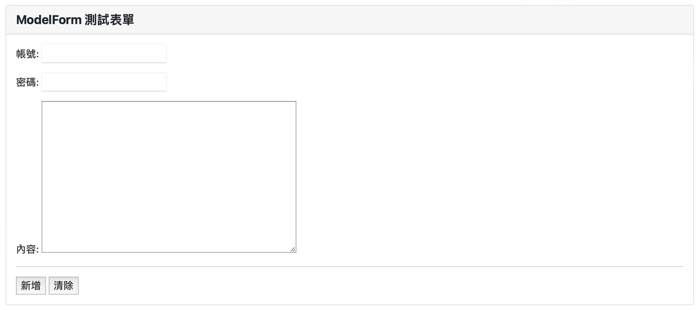
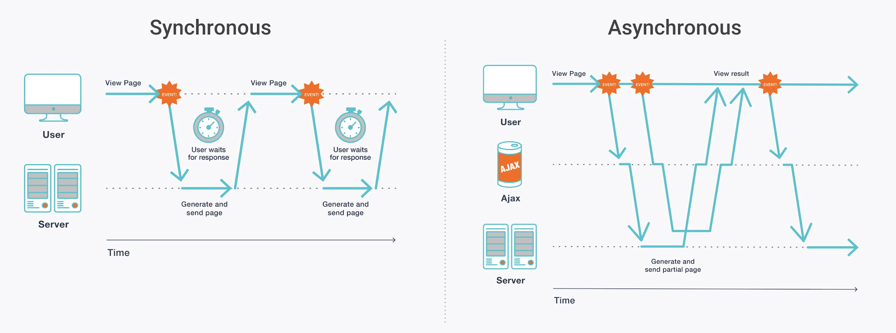

# Django III

## 網頁表單

過去曾經提及「靜態網站」與「動態網站」的概念。如果使用者只是瀏覽資料（例如：維基百科、系所網站），這些屬於靜態網站；如果使用者要與網站互動（例如：購物網站、網頁分析工具），這些都屬於動態網站。

想要讓使用者與網站互動，通常需要準備一些選單或輸入欄，這時就需要使用表單功能。

一個簡單的表單範例如下：
``` html
<form action="/" method="GET">
  <label for="user_name">請輸入帳號：</label>
  <input type="text" id="user_name" name="user_name">
  <label for="user_pass">請輸入密碼：</label>
  <input type="password" id="user_pass" name="user_pass">
  <br>
  <input type="submit" value="輸入">
  <input type="reset" value="清除">
</form> 
```

透過表單可以讓使用者與後端互動，將訊息傳送到資料庫或 views 來計算與分析，當然也可以做到簡單的用戶登入與發文功能。

在 Django 中，有兩種方式來製作表單，第一種是透過 HTML \<form> ，第二種是透過 ModelForm ，我們會在後續內容分別介紹。

### HTTP Request Method

HTTP Method 定義了一些能從特定網址，執行特定操作的請求方法，其中最常被使用的是 **GET** 與 **POST** 兩種方式。

- **GET**
    - 直接將要傳送的資料以 Query String（key-vaule）加在我們要寄送的網址 (URL) 後面。
    - 類似於寄送「明信片」，所有資訊以明文傳送。
    - 瀏覽器會把 http header 和 data 一併傳送出去，server response 200 (Successful)。
- **POST**
    - 將資料放在封包裡面傳輸。
    - 類似於寄送「掛號信件」，郵差只會看到寄件人跟收件人地址，看不到內文。
    - 瀏覽器先傳送 header，server response 100 (Continu)；瀏覽器再傳送 data，server response 200 (Successful)。

### HTML \<form>

首先，我們回到 Django 第二章最後一節「資料安全」，來看一下如何用傳統方式做出一個 HTML 表單：

``` html
<div class="card">
    <div class="card-header fs-5 fw-bold">
        ORM 測試表單
    </div>
     
    <div class="alert alert-warning">{{ message }}</div>
    
    <div class='card-body'>
        <form name="comment" method="GET">
            <label for="user_id">帳號：</label>
            <input type="text" id="user_id" name="user_id">
            <label for="user_pass">密碼：</label>
            <input type="password" id="user_pass" name="user_pass" class="mb-2">
            <hr>
            <input type="submit" value="送出">
            <input type="reset" value="清除">
        </form>
    </div>
</div>
```


這裡我們先示範用 GET 方式來接收表單，我們到 `views.py` 修改如下：
``` python
def form(request):

    try:
        id = request.GET['user_id']
        password = request.GET['user_pass']
        user = User.objects.filter(user_id=id, user_pass=password)

        if user:
            message = user[0].user_content
        else:
            message = "ID or Password not found."
            
    except:
        pass
    
    return render(request, 'form.html', locals())
```

當我們啟動伺服器，按下「submit」後，網址會刷新成以下附帶參數的形式，代表順利用 GET 方式更新資料庫：
```
http://127.0.0.1:8000/web_tool/form/?user_id=admin&user_pass=admin
```
但有時候，我們不希望表單的內容透過網址的方式傳遞，這容易被有心人士擷取內容（例如上面的帳號與密碼）。關於敏感資訊，我們通常使用 POST 的方式來傳遞訊息。可以修改表單如下：
``` html
<form name="comment" method="POST">
    
    ...  
</form>
```
其中， `` 是 Django 防止網站 CSRF (cross-site request forgery) 攻擊的機制，讓駭客無法偽裝成驗證過的網站來騙取使用者資訊。若是不加上這行， Djanog 會出現 403 Error (Forbidden) 。

之後，我們將剛剛 `views.py` 中的 GET 方式都改成 POST，應該就可以順利用 POST 來傳遞表單了。
``` python
id = request.POST['user_id']
password = request.POST['user_pass']
```

### ModelForm

除了透過 HTML \<form>，Django 本身也提供 form 模組來直接產生表單，請在 web_tool 資料夾下建立一個 `forms.py`：
``` python
from django.forms import ModelForm
from web_tool import models

class UserForm(ModelForm):
    class Meta:
        model = models.User
        fields = ['user_id', 'user_pass', 'user_content']
        labels = {
            'user_id': '帳號',
            'user_pass': '密碼',
            'user_content': '內容',
        }
```

Meta 的部分可以設定表單細節，例如要用哪個 model、哪些欄位，以及欄位名稱，詳細使用可以參考 [官方文件](https://docs.djangoproject.com/en/4.0/topics/forms/modelforms/)。

接著我們新增相關表單在 `form.html`：
``` html
<div class="card mt-3">
    <div class="card-header fs-5 fw-bold">
        ModelForm 測試表單
    </div>
     
    <div class="alert alert-warning">{{ message3 }}</div>
    
    <div class='card-body'>
        <form name="comment" method="POST">
            
            {{ user_form.as_p }}
            <hr>
            <input type="submit" value="新增">
            <input type="reset" value="清除">
        </form>
    </div>
</div>
```

我們可以看見表單的部分只需要一句 `{{ user_form.as_p }} `就可以自動產出整個 UserForm ，且會自動整合 Model 內容（如 ForeignKey ），輸入內容不符合資料格式也會自動偵測並提醒，非常方便。另外， `{{ user_form.as_p }}` 代表要將表單用 \<p> 來輸出，我們也可以用 `.as_table` 、 `.as_ul` 等其他方式。請注意 Django Form 不會自動產生 \<table> 等上下文標籤，需要自己加。

我們稍微改寫下 `views.py` 的 import 方式，讓程式比較清楚。接著我們進一步改寫以下函式：
``` python
from web_tool import models, forms

...

def form(request):
    
    ...
    
    # ModelForm
    if request.method == 'POST':
        user_form = forms.UserForm(request.POST)
        if user_form.is_valid():
            user_form.save()
            message3 = 'Saved successfully.'
        else:
            message3 = 'Something wrong, please check again.'
    else:
        user_form = forms.UserForm()
    
    return render(request, 'form.html', locals()) 
```

完成後即可順利在 http://127.0.0.1:8000/web_tool/form/ 中註冊新帳戶進資料庫。



ModelForm 的好處在於可以直接與資料庫連動，對於簡單的讀寫操作比較方便。

然而，不論以上哪種方式，都需要透過使用者按下按鈕，接著傳送資料封包到後端伺服器，經過處例後重新輸出頁面給瀏覽器。也就是說，使用者每次送出表單，網頁都必須重整 (refresh)，再透過 Server-side Rendering 的方式回傳結果。

有沒有更彈性、不影響使用者體驗的方式呢？這就必須進一步談到如何實作 Client-side Rendering，也就是透過 **Ajax** 的方式，在前後端之間傳輸「資訊」，再透過 JavaScript 即時更新網頁元件，而不需要整個重新載入頁面。


## Ajax

Ajax 全名 Asynchronous JavaScript and XML，是一種透過非同步方式，與網頁後端互動的技術。使用者在前端按下 Submit 後，可以繼續瀏覽、操作網頁，不影響後端資料的傳輸與運算。



JavaScript 本身就支援 Ajax 語法，然而 jQuery 很棒的一點是將 Ajax 語法簡化，變得更加易於使用。

我們先新增第四個表單項目在 `form.html`:
``` html

<script>csrf_token= "{{ csrf_token }}"</script>

...

<div class="card mt-3">
    <div class="card-header fs-5 fw-bold">
        Ajax 測試表單
    </div>
    <div id="message"></div>
    <div class='card-body'>
        <form id="ajax_form">
            <label for="gene_id" class="form-label">Gene ID:</label>
            <input type="text" class="form-control" name="gene_id" placeholder="eg. WBGene00000010">
        </form>
        <hr>
        <button class="btn btn-outline-primary" id="submit">送出</button>
    </div>
</div>

...

<script src=""></script>
```

我們一樣必須加上 CSRF token。不同的是，這次我們不直接透過 HTML 表單來傳輸資料，而是先將 token 預存進一個變數裡，給後續的 JavaScript Ajax 使用。

接著我們撰寫對應的 JavaScript 文件在 `static/js/form.js`：
```javascript
$(document).ready(function(){

    $('#submit').click(function(){
        
        $.ajax({
            headers: { 'X-CSRFToken': csrf_token },
            type: 'POST',
            url: '/web_tool/ajax_data/', 
            data: $('#ajax_form').serialize(),
            success: function(response){ 
                $("#message").html('<div class="alert alert-warning">' + response.message + '</div>');
            },
            error: function(){
                alert('Something error');
            },
        });
    });
});
```
這邊，我們設計當使用者按下 Submit 按鈕後觸發 Ajax，透過特殊路徑 `web_tool/ajax_data/` 以 **POST** 方式傳遞資料，傳遞時必須夾帶剛剛產生的 CSRF token 進封包的 header 內。

傳遞的資料，我們使用 `$('#ajax_form').serialize()`，意思是將表單內容序列化成 URL encoded text string，以這邊為例就是轉為 `gene_id=WBGene00000010` 的字串。

後端部分，我們一樣在 `urls.py` 中新增路徑：
```python
path('ajax_data/', views.ajax_data),
```

然後在 `views.py` 中新增對應函式：
```python
from django.http import JsonResponse

...

def ajax_data(request):
    
    gene_id = request.POST['gene_id']
    
    try:
        gene = models.Gene.objects.get(gene_id=gene_id)
        transcript = gene.transcript_id
        numbers = gene.numbers
        message = 'Transcript ID: ' + transcript + '<br>Numbers: ' + str(numbers)
        
    except:
        message = 'Something wrong, please check again.'
    
    response = {
        'message': message
    }
    return JsonResponse(response)
```

這樣即完成前後端的 Ajax 溝通。

啟動伺服器，進行測試後可以發現，送出表單不會刷新頁面，而是直接透過 `ajax_form/` 路徑傳遞資料，再透過 jQuery 更新前端頁面。


我們進一步可以發現，Django 產生的 CSRF token 不需要被包裝在 \<form> 當中，所以可以直接將整組語法搬去 `base.html` 共用：

```html
<!-- content -->

<script>
    csrf_token= "{{ csrf_token }}"
</script>
 
```

此外，同一個頁面可能有很多 Ajax 表單，有些設定是可以被共用的。我們可以新增一個 `ajaxSetup()` 來進行全域設定：
```javascript
$.ajaxSetup({
    headers: { 'X-CSRFToken': csrf_token },
    type: 'POST',
});

$(document).ready(function(){

    $('#submit').click(function(){
        
        $.ajax({
            url: '/web_tool/ajax_data/', 
            data: $('#ajax_form').serialize(),
            success: function(response){ 
                $("#message").html('<div class="alert alert-warning">' + response.message + '</div>');
            },
            error: function(){
                alert('Something error');
            },
        });
    });
});
```

這樣每個表單的 Ajax 設定就會只剩下路徑、資料、成功、失敗等要素，處理起來更簡潔。

比較上述四種表單，我們可以發現 POST 比 GET 相對更安全一些，Ajax 又比 html \<form> 使用體驗更佳。實驗室的網頁分析工具常常需要仰賴後端一定時間的運算，去做爬蟲或大數據分析，這時使用 Ajax 才能確保前端體驗順暢，不會因為後端響應時間而讓前端頁面延宕。
