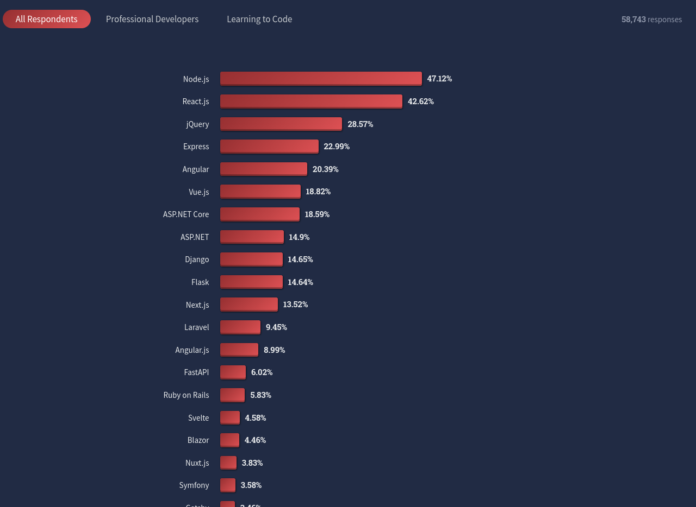
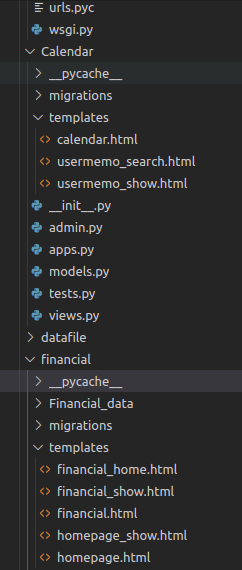
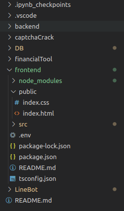

# 網頁技術介紹
> - Webex 會議錄製檔： undefined吳謂勝's Personal Room-20211110 1307-1 vue, react, web socket  
>    密碼： kQwFxAJ3  
>    錄製檔鏈結： https://nckucc.webex.com/nckucc/ldr.php?RCID=bccdb1d6c86402b2793831a29bfa64f1
    
## [2022 most popular Web Frameworks And Technologies](https://survey.stackoverflow.co/2022/#most-popular-technologies-webframe)


## [Node.js](https://nodejs.org/en/)


* Node.js 是什麼呢？根據官網的說法：
>Node.js® is a JavaScript runtime built on Chrome's V8 JavaScript engine.

* Node.js 就是一個能執行 JavaScript 的環境，而 V8 則是主流瀏覽器 - Google Chrome 的 JavaScript 引擎，負責解析、執行 JavaScript。

* python -> python app.py, nodejs -> npm app.js

* [15 Companies That Use Node.js in 2021 Successfully](https://www.trio.dev/blog/companies-use-node-js)  


## 為什麼要使用前端框架?

### 早期的技術 jQuery
* jQuery在早期的時代，jQuery以語法簡潔、直覺好用的元素選取器，語法便捷的事件監聽等等的優點深受開發者的喜愛

* 對於目前網站功能越來越多且越複雜的情況下，jQuery缺點也逐漸浮現
    * jQuery 很慢

    * jQuery 程式不模組化很鬆散難控管

    * 對動畫或特效方面的功能支援很差

### 目前主流的前端新技術


* 這些前端框架的功能在於提升開發效率、降低維護難度的開發架構

#### 資料與 UI 分離

```javascript=
// Jquery

let commentData = [
  { name: 'Gary', comment: 'try harder'},
  { name: 'Alice', comment: 'good'},
  { name: 'Bob', comment: 'excellent'},
  //...
]

commentData.forEach(c => {
  $('#root').append(
    $(document.createElement('div')).append(
      $(document.createElement('h3')).text(c.name),
      $(document.createElement('p')).text(c.comment)
    ).addClass('card')
  )
})
```

```javascript=
// Vue 可讀性高及好維護

<template>
  <div id="root">
    <div class="card" v-for="item in commentData" :key="name">
      <h3 class="name">{{item.name}}</h3>
      <p class="comment">{{item.comment}}</p>
    </div>
  </div>
</template>

<script>
export default {
  data() {
    return {
      commentData: [
        { name: 'Gary', comment: 'try harder'},
        { name: 'Alice', comment: 'good'},
        { name: 'Bob', comment: 'excellent'},
        //...
      ]
    }
  }
}
</script>
```

#### 模組化的 UI
* 一個網站總是會有一些重複出現的元素，例如按鈕、輸入表單、表格、對話框等等，像是FaceBook 的按讚按鈕，可能一個頁面出現數十個都不為過；而在現代框架的概念中，我們會把這些重複出現的元素稱為 組件（Components），每個組件內包含了組件自己需要用的結構、樣式、邏輯

```javascript=
// card class
    
<template>
  <div class="card">
    <h3 class="name">{{name}}</h3>
    <p class="comment"></p>{{comment}}</p>
  </div>
</template>
<script>
export default {
  name: 'Card',
  props: {
    name: [String],
    comment: [String]
  }
}
</script>
```

```javascript=
// html page

<template>
  <div id="root">
    <Card v-for="item in commentData" v-bind:"item" :key="name" />
  </div>
</template>

<script>
import Card from './components/Card'

export default {
  components: {
    Card
  },
  data() {
    return {
      commentData: [
        { name: 'Gary', comment: 'try harder'},
        { name: 'Alice', comment: 'good'},
        { name: 'Bob', comment: 'excellent'},
        //...
      ]
    }
  }
}
</script>
```

## React


### SPA (Single-Page-Application)
* 以往需要準備許多html，根據不同的URL去渲染  


* SPA下只會有一個html並把其中的 tag 當作"容器"而已  


```javascript=
<!DOCTYPE html>
<html lang="en" style="height: 100%;">
  <head>
    <meta charset="utf-8" />
    <title>Financial</title>
    <link rel = "stylesheet" href = "index.css">
  </head>

  <body style = "height: 100%;">
    <div calss = "container" id = "root" style = "height: 100%;"></div>
  </body>
</html>
```

```javascript=
// index.js

import React from 'react';
import ReactDOM from 'react-dom';
import App from './App';
import 'bootstrap/dist/css/bootstrap.css';

ReactDOM.render(
  <React.StrictMode>
    <App />
  </React.StrictMode>,
  document.getElementById('root')
);
```

### 透過URL更改前端元件

```javascript=
//App.js

import { BrowserRouter, Route, Routes, Navigate } from 'react-router-dom';
import React from 'react';
import HomeComp from './component/homePage/homeComp';
import LoginComp from './component/loginPage/loginComp';
import RegisterComp from './component/registerPage/registerComp';
import CalendarComp from './component/calendarPage/calendarComp';
import PrivateRoute from './privateRoute';
import LoginRoute from './login_privateRoute';
import DatabaseComp from './component/databasePage/databaseComp';
import PostBoardComp from './component/postBoardPage/postBoardComp';
import LineMemoComp from './component/lineMemoPage/lineMemoComp';
import MeetingDataComp from './component/meetingDataPage/meetingDataComp';
import IndustryAnalysisComp from './component/Industry_analysisPage/Industry_analysisComp';
import UserListComp from './component/userListPage/userListComp';
import DatabaseSearchComp from './component/databasePage/databaseSearchComp';
import StockPricingStratagyComp from './component/stock_pricing_stratagyPage/stock_pricing_stratagyComp';

function App() {
  return (
    <>
      <BrowserRouter>
        <Routes>
          <Route exact path = "*" element = { <Navigate to = "/login"/> } ></Route>

          <Route element = { <LoginRoute /> } >
            <Route exact path = "/login" element = { <LoginComp /> }></Route>
          </Route>

          <Route path = "/register" element = { <RegisterComp /> }></Route>
          
          <Route element = { <PrivateRoute /> } >
            <Route path = "/home" element = { <HomeComp /> }></Route>
            <Route path = "/calendar" element = { <CalendarComp /> }></Route>
            <Route path = "/database" element = { <DatabaseComp /> } ></Route>
            <Route path = "/database/search/:stockNum_Name" element = { <DatabaseSearchComp /> } ></Route>
            <Route path = "/post_board" element = { <PostBoardComp /> } ></Route>
            <Route path = "/line_memo" element = { <LineMemoComp /> } ></Route>
            <Route path = "/meeting_data" element = { <MeetingDataComp /> } ></Route>
            <Route path = "/industry_analysis" element = { <IndustryAnalysisComp /> } ></Route>
            <Route path = "/userList" element = { <UserListComp /> } ></Route>
            <Route path = "/stock_pricing_stratagy" element = { <StockPricingStratagyComp /> } ></Route>
          </Route>
        </Routes>
      </BrowserRouter>
    </>
  );
}

export default App;
```

### React提供class或function實做componant
* 有了class為什麼還需要function
1. 上手難度較高，必須要有OO(Object-Oriented)的概念
2. 需要考慮componant的生命週期，用法較不彈性，可能同時要在componentDidMount抓資料跟建立event listener
```javascript=
class Clock extends React.Component {
    
    //class init時
    constructor(props) {
        super(props);
        this.state = {date: new Date()};
    }
    
    //當component render後要做甚麼
    componentDidMount() {
    }
    
    //當component 移除時要做甚麼
    componentWillUnmount() {
    }
    
    render() {
        return (
            <div>
                <h1>Hello, world!</h1>
                <h2>It is {this.state.date.toLocaleTimeString()}.</h2>
            </div>
        );
    }
}
```
* class vs function
```javascript=
//class
class Example extends React.Component {
  constructor(props) {
    super(props);
    this.state = {
      count: 0
    };
  }

  render() {
    return (
      <div>
        <p>You clicked {this.state.count} times</p>
        <button onClick={() => this.setState({ count: this.state.count + 1 })}>
          Click me
        </button>
      </div>
    );
  }
}

//function
function Example() {
  const [count, setCount] = useState(0);

  return (
    <div>
      <p>You clicked {count} times</p>
      <button onClick={() => setCount(count + 1)}>
        Click me
      </button>
    </div>
  );
}
```

### Hook
* 可以不用透過寫class的方式，使用有關生命週期的功能
* useState -> 可以動態紀錄變數的狀態
```javascript=
// 計數器
import React, { useState } from 'react';

function Example() {
  // 宣告一個新的 state 變數，我們稱作為「count」。
  const [count, setCount] = useState(0);

  return (
    <div>
      <p>You clicked {count} times</p>
      <button onClick={() => setCount(count + 1)}>
        Click me
      </button>
    </div>
  );
```
* useEffect -> render後可以繼續做的事 ex: fetch資料、更改DOM等等
```javascript=
// 計數器變化後更改網頁的title
import React, { useState, useEffect } from 'react';

function Example() {
  const [count, setCount] = useState(0);

  useEffect(() => {
    document.title = `You clicked ${count} times`;
  });

  return (
    <div>
      <p>You clicked {count} times</p>
      <button onClick={() => setCount(count + 1)}>
        Click me
      </button>
    </div>
  );
}
```

* 客製化自己的hook
```javascript=
// 顯示朋友上線狀態
function FriendStatus(props) {
  const isOnline = useFriendStatus(props.friend.id);

  if (isOnline === null) {
    return 'Loading...';
  }
  return isOnline ? 'Online' : 'Offline';
}

//useFriendStatus
import React, { useState, useEffect } from 'react';

function useFriendStatus(friendID) {
  const [isOnline, setIsOnline] = useState(null);

  function handleStatusChange(status) {
    setIsOnline(status.isOnline);
  }

  useEffect(() => {
    ChatAPI.subscribeToFriendStatus(friendID, handleStatusChange);
    return () => {
      ChatAPI.unsubscribeFromFriendStatus(friendID, handleStatusChange);
    };
  });

  return isOnline;
}
```

## 推薦的套件

### [Bootstrap](https://getbootstrap.com/) 前端模板


### [Material UI](https://mui.com/zh/) 前端模板
  


### [React Router](https://reactrouter.com/) 路由
  


### [Axios](https://www.npmjs.com/package/react-axios) API請求


### [Express](https://github.com/expressjs/express) 後端框架

